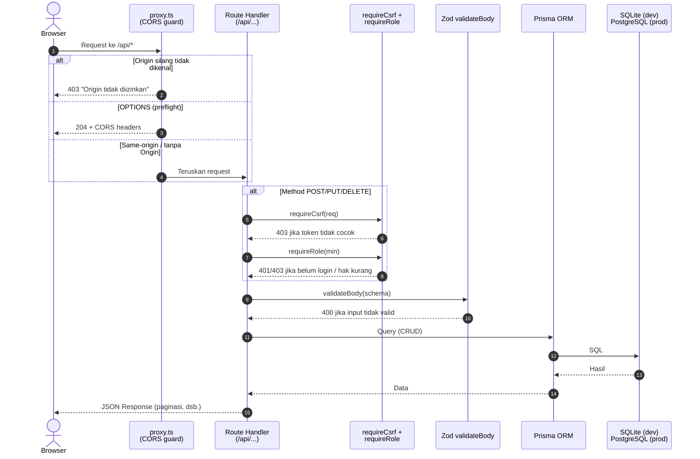
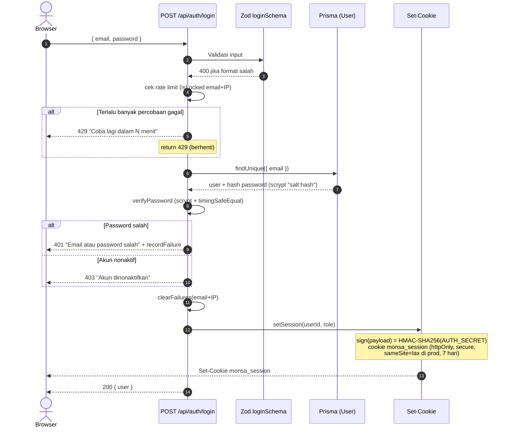
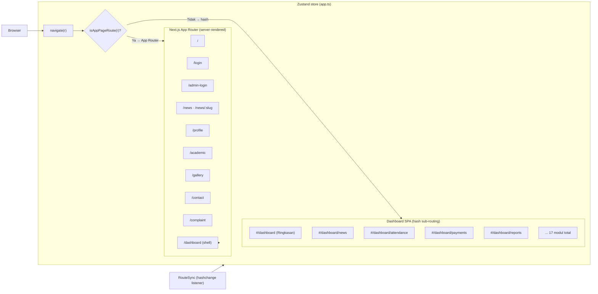

# Arsitektur CMS MONSA — UPT SPF SD Negeri Unggulan Mongisidi 1

Dokumen diagram arsitektur visual. Semua diagram ditulis dalam **Mermaid** —
render otomatis di GitHub, VS Code (ekstensi Mermaid), atau
[mermaid.live](https://mermaid.live).

---

## 1. Struktur Folder

```mermaid
flowchart TD
    ROOT["CMS MONSA/"] --> PRISMA["prisma/"]
    ROOT --> SRC["src/"]
    ROOT --> PUBLIC["public/"]
    ROOT --> SCRIPTS["scripts/"]
    ROOT --> E2E["e2e/"]
    ROOT --> ZSCRIPTS[".zscripts/"]
    ROOT --> CFG1["next.config.ts"]
    ROOT --> CFG2["tailwind.config.ts"]
    ROOT --> CFG3["eslint.config.mjs"]
    ROOT --> CFG4["vitest.config.ts"]
    ROOT --> CFG5["playwright.config.ts"]
    ROOT --> CFG6["Caddyfile"]
    ROOT --> CFG7["components.json"]
    ROOT --> DOCS1["README.md"]
    ROOT --> DOCS2["DEPLOYMENT.md"]
    ROOT --> DOCS3["PROGRESS_LOG.md"]
    ROOT --> ENV1[".env.example"]

    PRISMA --> P1["schema.prisma (SQLite dev)"]
    PRISMA --> P2["schema.postgres.prisma (PostgreSQL prod)"]
    PRISMA --> P3["seed.ts"]
    PRISMA --> P4["migrations/"]

    SRC --> APP["app/ (App Router)"]
    SRC --> COMP["components/"]
    SRC --> HOOKS["hooks/"]
    SRC --> I18N["i18n/"]
    SRC --> LIB["lib/"]
    SRC --> STORE["store/"]
    SRC --> PROXY["proxy.ts (CORS)"]

    APP --> APAGES["page.tsx · login · admin-login<br/>profile · academic · gallery<br/>contact · complaint · news/[slug]<br/>dashboard · error · not-found"]
    APP --> API["api/ (REST)"]
    API --> A1["auth/ · news/ · announcements/"]
    API --> A2["agenda/ · gallery/ · achievements/"]
    API --> A3["teachers/ · students/ · classes/"]
    API --> A4["attendances/ · payments/ · reports/"]
    API --> A5["documents/ · enrollments/ · complaints/"]
    API --> A6["contact · contact-messages · users/"]
    API --> A7["site-settings · activity-logs · bulk"]
    API --> A8["search · rss · stats · upload · csrf-token"]

    COMP --> C1["public/ (situs publik)"]
    COMP --> C2["dashboard/ (panel admin)"]
    COMP --> C3["auth/ (login views)"]
    COMP --> C4["shared/ (error-boundary, seo, dll)"]
    COMP --> C5["ui/ (shadcn/ui)"]

    I18N --> I1["request.ts (next-intl v4)"]
    I18N --> I2["locales.ts"]
    I18N --> I3["use-i18n.ts"]
    I18N --> I4["messages/id.json + en.json"]

    LIB --> L1["db.ts · auth.ts · csrf.ts"]
    LIB --> L2["validations.ts (Zod) · rate-limit.ts"]
    LIB --> L3["email.ts (Nodemailer) · log.ts"]
    LIB --> L4["format.ts · sanitize.ts · password.ts"]
    LIB --> L5["types.ts · nav.ts · export.ts · utils.ts"]

    STORE --> S1["app.ts (Zustand + hash router)"]
    PUBLIC --> U1["uploads/ (file user)"]
```



---

## 2. Alur Request

### 2.1 Alur API Umum (pipeline keamanan)



### 2.2 Alur Login & Session (HMAC cookie)



### 2.3 Routing Hybrid (App Router + hash sub-route)



---

## 3. ERD Database (17 model)

```mermaid
erDiagram
    User ||--o{ News : "author"
    User ||--o{ ActivityLog : "activityLogs"
    User o|--o{ ContactMessage : "handledBy"
    User o|--o{ Complaint : "responseBy"
    User ||--o{ Document : "uploadedDocuments"
    User o|--o{ Enrollment : "reviewedEnrollments"
    User o|--o{ Attendance : "attendanceRecords"
    User o|--o{ Payment : "paymentRecords"
    User }o--o| Class : "guardianClass"

    Teacher o|--o{ Class : "homeroomTeacher"
    Class ||--o{ Student : "students"
    Class ||--o{ Attendance : "attendances"
    Class }o--o| User : "guardianUsers"

    Student ||--o{ Attendance : "attendances"
    Student ||--o{ Payment : "payments"

    User {
        string id PK
        string name
        string email UK
        string password
        string role "SUPER_ADMIN|OPERATOR|GURU"
        string guardianClassId FK
        boolean isActive
        datetime createdAt
        datetime updatedAt
    }
    News {
        string id PK
        string title
        string slug UK
        string excerpt
        string content
        string coverImage
        string category "Akademik|Kegiatan|Prestasi"
        string status "DRAFT|PUBLISHED"
        string authorId FK
        datetime publishedAt
    }
    Announcement {
        string id PK
        string title
        string content
        boolean isPinned
        datetime expiresAt
        boolean isActive
    }
    Agenda {
        string id PK
        string title
        string description
        datetime date
        string time
        string location
        string category "Akademik|Kegiatan|Libur|Umum"
    }
    Teacher {
        string id PK
        string name
        string position
        string subject
        string education
        string photo
        int order
        boolean isActive
    }
    GalleryItem {
        string id PK
        string title
        string description
        string type "PHOTO|VIDEO"
        string url
        string thumbnail
        string category
    }
    Achievement {
        string id PK
        string title
        string description
        string studentName
        string level "Sekolah s/d Internasional"
        string category "Akademik|Non-Akademik"
        datetime date
    }
    Class {
        string id PK
        string name UK
        string grade "1-6"
        string stream
        string academicYear
        string homeroomTeacherId FK
        boolean isActive
    }
    Student {
        string id PK
        string nis UK
        string nisn
        string name
        datetime dateOfBirth
        string gender "LAKI_LAKI|PEREMPUAN"
        string address
        string phone
        string email
        string parentName
        string parentPhone
        string classId FK
        boolean isActive
        datetime enrollmentDate
    }
    Attendance {
        string id PK
        string studentId FK
        string classId FK
        datetime date
        string status "HADIR|SAKIT|IZIN|ALFA"
        string note
        string createdById FK
        string uniqueKey UK "studentId + date"
    }
    Payment {
        string id PK
        string studentId FK
        int amount
        datetime paymentDate
        string monthPeriod "2026-07"
        string status "PAID|UNPAID"
        string note
        string recordedById FK
    }
    Document {
        string id PK
        string title
        string description
        string fileUrl
        string fileName
        int fileSize
        string mimeType
        string category
        string uploadedById FK
        boolean isPublic
        int downloadCount
    }
    Enrollment {
        string id PK
        string nisn
        string fullName
        string gender
        datetime dateOfBirth
        string placeOfBirth
        string address
        string phone
        string email
        string parentName
        string parentPhone
        string parentEmail
        string parentOccupation
        string previousSchool
        string programChoice "Zonasi|Afirmasi|Prestasi|Perpindahan"
        string birthCertUrl
        string diplomaUrl
        string photoUrl
        string status "PENDING|REVIEWING|ACCEPTED|REJECTED"
        string notes
        string reviewedById FK
        datetime reviewedAt
    }
    SiteSetting {
        string id PK "singleton"
        string schoolName
        string npsn
        string logo
        string address
        string phone
        string email
        string mapEmbed
        string vision
        string mission
        string history
        string principalName
        string principalPhoto
        string principalWelcome
        string facebook
        string instagram
        string youtube
        string tiktok
        int studentCount
        int teacherCount
        int facilityCount
        int achievementCount
        string spmbInfo
        string spmbLink
    }
    ActivityLog {
        string id PK
        string userId FK
        string userName
        string action "CREATE|UPDATE|DELETE|LOGIN|LOGOUT"
        string entity
        string entityId
        string detail
        datetime createdAt
    }
    ContactMessage {
        string id PK
        string name
        string email
        string phone
        string subject
        string message
        boolean isRead
        string handledBy FK
    }
    Complaint {
        string id PK
        string name
        string email
        string phone
        string role "Orang Tua|Siswa|Masyarakat|Alumni"
        string category "Akademik|Fasilitas|Tata Tertib|Tenaga Pendidik|Lainnya"
        string subject
        string message
        boolean isAnonymous
        string status "BARU|DIPROSES|SELESAI|DITOLAK"
        string priority "RENDAH|NORMAL|TINGGI"
        string response
        string responseBy FK
        datetime respondedAt
    }
```

---

## Catatan Akurasi (perbaikan vs. dokumentasi lama)

- CORS ditangani oleh **`src/proxy.ts`** (matcher `/api/:path*`) — *bukan*
  `src/middleware.ts` / `src/lib/cors.ts` seperti yang tertulis di `DEPLOYMENT.md`.
- Konfigurasi next-intl ada di **`src/i18n/request.ts`** (pola next-intl v4),
  bukan `src/i18n/config.ts`.
- Folder `docs/` sebelumnya hilang dari repo — file ini dibuat ulang.
- SQLite dev menyimpan data di `db/custom.db` (`DATABASE_URL="file:./db/custom.db"`).
